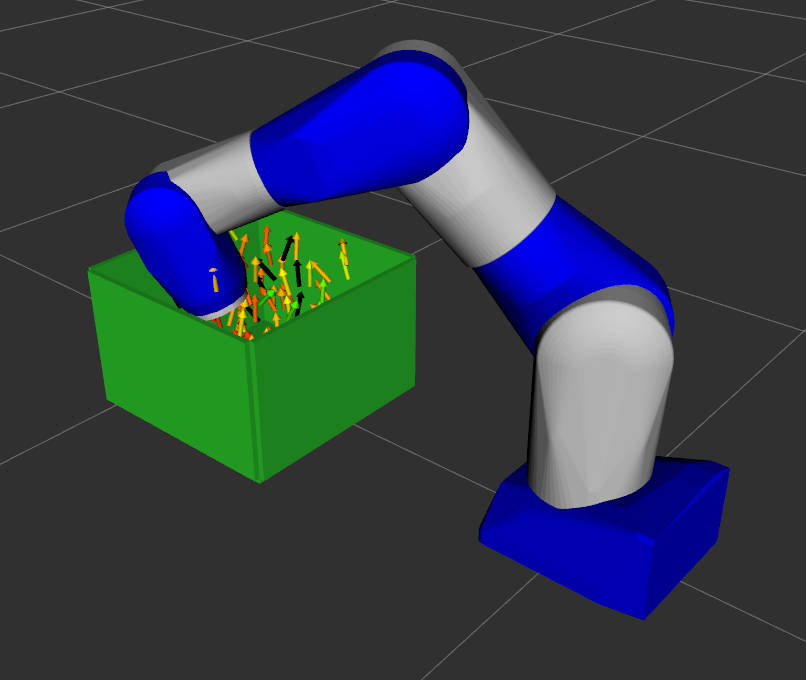

# Pick and Place Reach Study

## Problem Statement
Evaluate reachability of a pick and place system where a robot must pick a collection of random objects from a bin of specifiable dimensions and location and place them onto a conveyor belt

## Tasks
### 1. Create a custom `TargetPoseGenerator`
We need to create a custom implementation of the `TargetPoseGenerator` interface for this reach study.
This class needs to generate random poses within the specified dimensions of a rectangular bin that simulate potential pick poses for boxes.
These random poses should have:

  - uniformly random positions within the bins
  - random orientations with the z-axis being within some specifiable angle tolerance (e.g., 45 degrees) of the bin origin frame z-axis

Complete the lines marked `TODO` in the partially complete [`pnp_target_pose_generator.py`](pnp_target_pose_generator.py) file

### 2. Create a custom `IKSolver`
We need to create a custom implementation of the `IKSolver` interface that knows how to add a collision representation of the bin to the robot environment.
This class can leverage all the functionality of the existing [`MoveItIKSolver`](https://github.com/ros-industrial/reach_ros2/blob/1.4.0/include/reach_ros/ik/moveit_ik_solver.h#L46) class, but also needs to add a function to add the bin collision geometry to the MoveIt planning scene.

We also need to create a plugin factory that can create new instances of this class and configure it with a YAML file.
The YAML configuration for this custom IK solver should include relevant parameters about the bin dimensions and location, such as:
    
  - bin dimensions (length, width, height)
  - bin dimension scale factor, such that the poses generated inside the bin are not too close to the bin walls
  - bin wall thickness
  - TF frame to which the bin is attached

Finally, we will need to export the plugin factory for use by REACH.

Most of the code has been written for these classes, and several helper methods have been provided for the implementation of these tasks.
Fill in the lines marked `TODO` in the partially complete [`pnp_ik_solver.cpp`](pnp_ik_solver.cpp) file

### 3. Configure the reach study to use the new classes
Now we need to update the reach study configuration file to leverage the new components we created.

Updating the IK solver configuration is relatively straightforward since it is a c++ plugin like the rest of the existing plugins.

Updating the target pose generator configuration is slightly different since we wrote it in Python.
In this case, the [`reach_study.py`](reach_study.py) script directly creates an instance of our custom target pose generator.
It will then pass the contents of the `target_pose_generator` YAML configuration directly into the class constructor as keyword arguments. 
Look at the class constructor to know what parameters should be set in the `target_pose_generator` section configuration file.

Fill in the lines marked `TODO` in the partially complete [`reach_study.yaml`](resources/reach_study.yaml) file

> Be sure to recompile the repository after making changes to c++ files

### 4. Run the reach study!

Run the reach study by first launching the setup launch file, then running the `reach_study.py` script

```commandline
ros2 launch reach_roscon_2023 setup.launch.py
python3 reach_study.py
```

If you successfully implemented the reach study code, you should see something like this:



Extra challenges:
- Move the bin around by changing the location of the bin frame in the URDF
- Change the dimensions of the bin
- Update the IK solver to inherit from `DiscretizedMoveItIKSolver` instead to create a tool z-axis free 
- Add gripper visual and collision geometry to the URDF

## Solution
The solution files for these tasks can be found in the [`solution` directory](solution)
