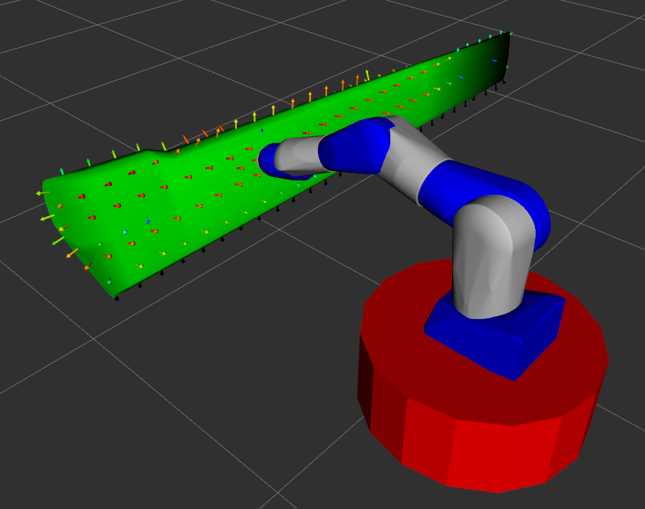
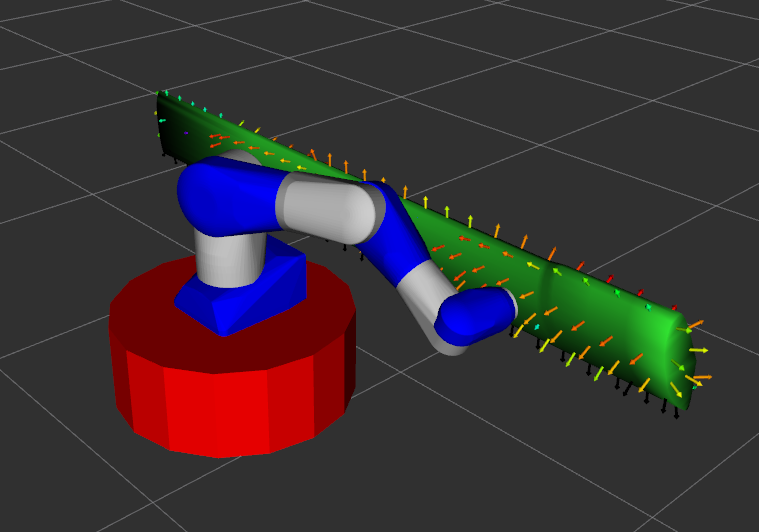

# Mobile Manipulator Reach Study

## Problem Statement
Evaluate reachability of a mobile manipulator system where a robot mounted on a mobile base must perform surface inspection of a large propeller blade

## Tasks
### 1. Update the URDF
Add a connection between the defined mobile base and the world frame in the URDF to allow for planar movement.
Complete the lines marked `TODO` in the partially complete [`reach_study.xacro`](reach_study.xacro) file.

> Note: Most MoveIt IK solvers do not support joints with more than one degree of freedom

### 2. Configure the motion group
Now that the URDF has a connection between the world frame and the mobile manipulator, we need to define a motion group for solving IK.
- Complete the lines marked `TODO` in the [`reach_study.srdf`](reach_study.srdf) file to define this motion group.
- Specify the `kinematic_base_frame` of this motion group in the [`reach_study.yaml`](reach_study.yaml) file

> Note: Most MoveIt IK solvers support kinematic chain types of motion groups

### 3. Configure the reach study
Complete the lines marked `TODO` in the partially complete [`reach_study.yaml`](reach_study.yaml) file.

#### 3a. Configure the target pose generator
You are given a [mesh of the propeller blade](resources/blade.ply) and a [set of points/normals that were sampled on the model](resources/blade.pcd).
Identify and configure the appropriate target pose generator that will turn those points/normals into target poses for the reach study and position them relative to the correct frame in the URDF

#### 3b. Configure the optimization parameters
Define the parameters for the reach study optimization stage in the [`reach_study.yaml`](reach_study.yaml) file.
- `max_steps`
  - The maximum number of iterations of optimization that should be performed before stopping
- `radius`
  - Defines the radius of a 3D sphere in which the neighbors of a given target pose should be used as the seed state for re-solving IK at that pose.
    If the radius is too small, high scoring robot configurations will not propagate through the reach study.
    If the radius is too large, the reach study will take significantly more time without adding much value. 
- `step_improvement_threshold`
  - The percentage of total score improvement between optimization steps (on [0, 1]), below which the optimization will terminate
- `max_threads` (optional)
  - The maximum number of CPU threads to use for the reach study (defaults to `std::hardware_concurrency()`)

Look [here](https://github.com/ros-industrial/reach/blob/1.6.0/src/reach_study.cpp#L271-L276) for further reference

#### 3c. Configure the evaluators
The evaluators drive the behavior of the robot in the reach study results for over-actuated systems. 
You should consider what factors are important for this application when choosing evaluators.
In this case, they might include:
- Prioritizing solutions that allow the robot to move in all dimensions (x, y, z, roll, pitch, yaw) equally easily
  - Is it necessary that the robot be able to move easily in all dimensions, or to only translate or only rotate equally easily in all directions?
- Maximizing distance from collision
- Prioritizing solutions more in the middle of the joint range

Find a set of existing evaluators from `reach` and `reach_ros` that makes the reach study results meet your defined criteria.

### 4. Run the reach study
Once the setup of the reach study is complete, run the reach study using the following command:

```commandline
ros2 launch reach_roscon_2023 setup_mm.launch.py
ros2 launch reach_roscon_2023 start_mm.launch.py
```

> Note: by default, the reach study results are saved in the directory `/tmp/reach_study/mobile_manipulator`. 
> You can change this to save to a custom path `<dir>/<subdir>` by specifying the options `results_dir:=<dir>` and `config_name:=<subdir>` in `start_mm.launch.py`

If you have successfully configured and run the reach study, you should see results that look like this:




Try running the reach study multiple times with different combinations of evaluators and optimization parameters to see their effects on the results.

### 5. Challenge
- Run the reach study using the `DiscretizedMoveItIKSolverFactory` IK solver to simulate a tool z-axis free application
- Write a Python script to load the results from a reach study and plot the improvement of scores over the course of the reach study
- Write a Python script to load the results from different reach studies and compare them
  - See [here](https://github.com/ros-industrial/reach_ros2/blob/1.4.0/scripts/demo.py) for a reference example
- Replace the robot with a different model. Re-run the reach study and compare the results from the original robot
- Re-sample the points on the propeller blade at a higher resolution and re-run the reach study

## Solution
The solution files for these tasks can be found in the [`solution` directory](solution)